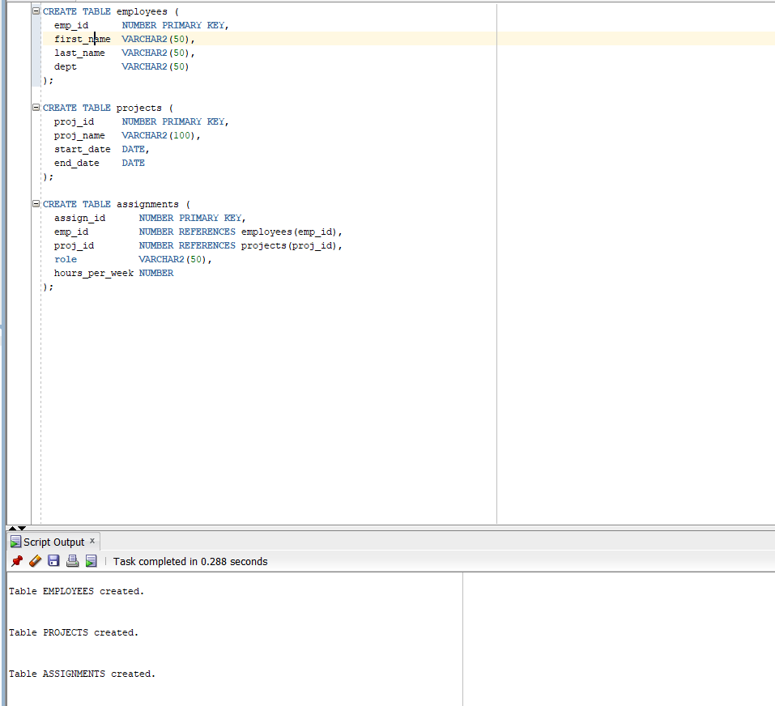
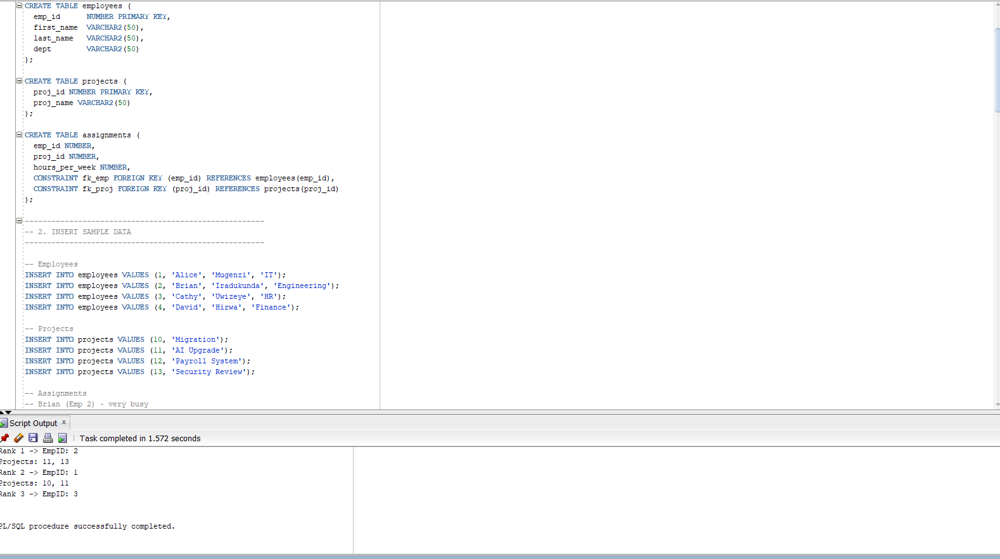

**Names: Isimbi Mushimire Iris**
**ID:27121**
**PLSQL Assignment**

# Employee-Project-Assignment-Analyzer

# PL/SQL Collections, Records & GOTO — Employee Project Assignment Analyzer

## Overview
Project demonstrates PL/SQL:
- RECORD type usage
- Collections: associative array, nested table, VARRAY
- Controlled use of GOTO (labelled block)
- Documentation, tests, and run instructions for SQL Developer

## Files
- `schema/create_tables.sql` — create tables


- `plsql/analyzer.sql` — main PL/SQL demo


- `data/run_test.sql` — run tests



- This README

## How to run (SQL Developer)
1. Open Oracle SQL Developer and connect to your database (SYSTEM or a test user).
2. Enable DBMS Output: View → DBMS Output → click + and choose your connection.
3. Open SQL Worksheet for your connection.
4. Run these commands in order (adjust paths):
   ```sql
   SET SERVEROUTPUT ON SIZE UNLIMITED;
   @C:\path\to\plsql-collections-demo\schema\create_tables.png
   @C:\path\to\plsql-collections-demo\data\run_test.png
   @C:\path\to\plsql-collections-demo\plsql\analyzer.png
